# Real-Time Banking Transaction Fraud Detection with Kafka

## Project Overview
This project is a technical Big Data project developed as part of the **Big Data Introduction** course.
The objective is to design and run a minimal **real-time fraud detection pipeline** using **Apache Kafka**.

The system simulates banking transactions that are streamed in real time. A Kafka consumer processes these events and applies simple fraud detection rules to identify suspicious transactions.

**Project type:** Technical Project (Option A)  
**Team:** Adam Kheloufi & Nils Giraud  
**Group:** GR07

## Chosen Tool: Apache Kafka

### Why we selected Kafka
We selected **Apache Kafka** because it is a core Big Data tool for **real-time event streaming**. Kafka is widely used to ingest and distribute continuous data flows with high throughput and low latency, which makes it suitable for use cases such as:
- banking transaction monitoring
- fraud detection and alerting
- log collection and real-time analytics
- streaming ETL pipelines

In our project, Kafka acts as the central **streaming backbone** between the transaction producer and the fraud detection consumer.

## Installation & Setup

### Prerequisites
- Docker Desktop (Windows)
- WSL2 (Ubuntu) (for running Linux commands on Windows)
- Git
  
### Run Kafka locally (Docker Compose)

```bash
git clone https://github.com/nilsgrd/bigdata-finalproject-Gr07-kafka-fraud-detection-GIRAUD-KHELOUFI.git
cd bigdata-finalproject-Gr07-kafka-fraud-detection-GIRAUD-KHELOUFI

docker compose up -d

docker compose ps
```

## Minimal Working Example (Kafka CLI)

```bash
# 1) Create (or list) the topic
docker exec -it real-time-fraud-kafka-kafka-1 bash -lc "kafka-topics --bootstrap-server localhost:9092 --list"
docker exec -it real-time-fraud-kafka-kafka-1 bash -lc "kafka-topics --bootstrap-server localhost:9092 --create --topic bank-transactions --partitions 1 --replication-factor 1"

# 2) Produce 3 sample events (CREATED / UPDATED / DELETED)
docker exec -i real-time-fraud-kafka-kafka-1 bash -lc "echo '{\"id\":10,\"user\":\"A\",\"amount\":120,\"event\":\"CREATED\"}' | kafka-console-producer --bootstrap-server localhost:9092 --topic bank-transactions"
docker exec -i real-time-fraud-kafka-kafka-1 bash -lc "echo '{\"id\":10,\"user\":\"A\",\"amount\":500,\"event\":\"UPDATED\"}' | kafka-console-producer --bootstrap-server localhost:9092 --topic bank-transactions"
docker exec -i real-time-fraud-kafka-kafka-1 bash -lc "echo '{\"id\":10,\"event\":\"DELETED\"}' | kafka-console-producer --bootstrap-server localhost:9092 --topic bank-transactions"

# 3) Consume from the beginning (run in another terminal)
docker exec -it real-time-fraud-kafka-kafka-1 bash -lc "kafka-console-consumer --bootstrap-server localhost:9092 --topic bank-transactions --from-beginning"
```

## Proof of Execution (Screenshots)

### 1) Environment ready
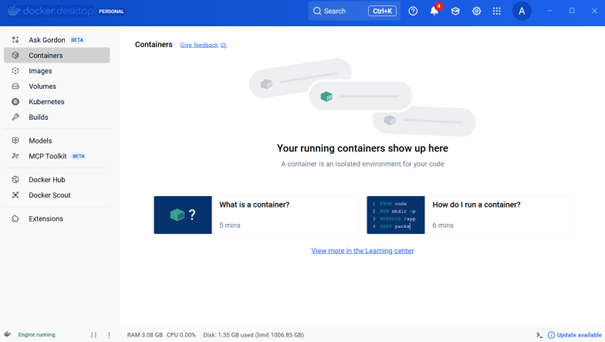
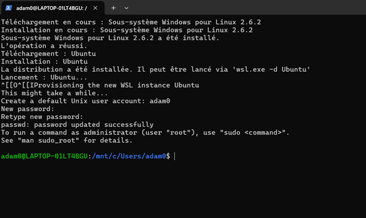

### 2) Project / Kafka configuration

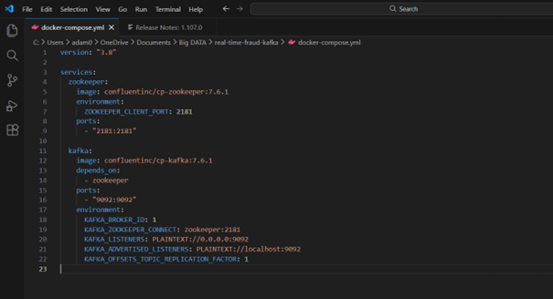

### 3) Project folder ready / docker-compose.yml present
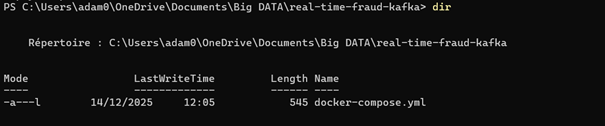

### 4) Kafka services running
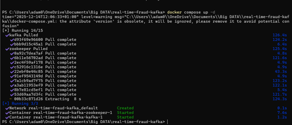
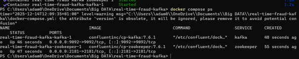

### 5) Producer & Consumer implementation
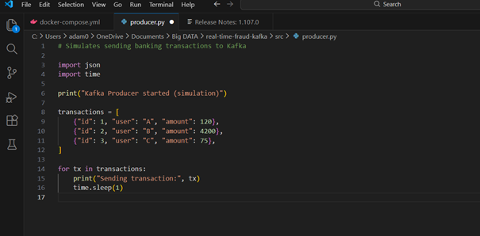
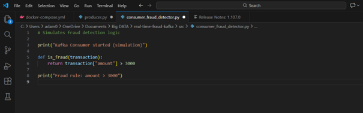

### 6) Execution proofs (CLI tests)
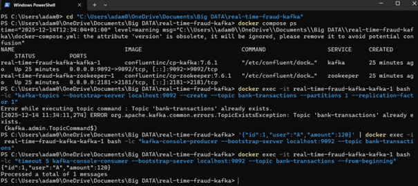
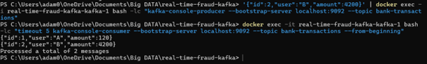
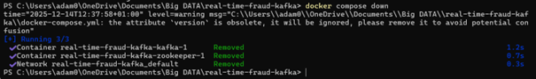
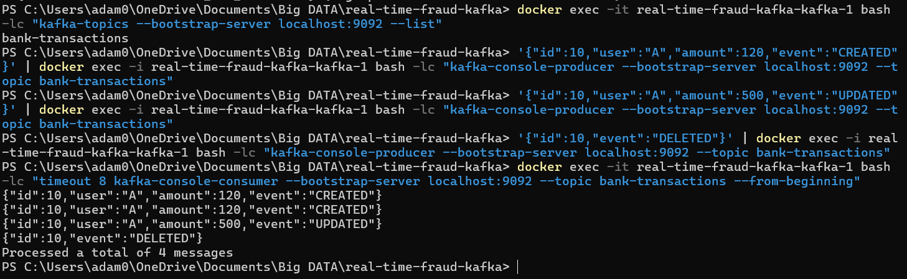

### 7) Sample input / output files
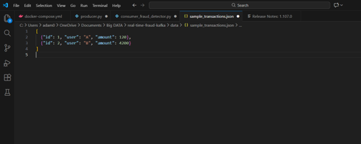
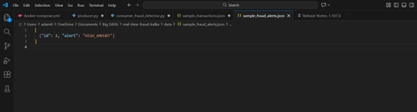

## Kafka in a Big Data Ecosystem

Apache Kafka is mainly used as an **event streaming backbone**. It sits between data producers (apps, services, IoT, logs) and multiple consumers (analytics, monitoring, databases).

In this project:
- **Producer** = a transaction simulator that publishes events to a Kafka topic
- **Kafka topic** = a durable stream of transactions (append-only log)
- **Consumer** = a fraud detection service that reads events in real time and raises alerts

In a real Big Data architecture, Kafka is often connected to:
- **Stream processing** (Spark Structured Streaming / Flink / Kafka Streams) to run more advanced fraud detection models
- **Storage layers** (HDFS / S3 / data lake) for long-term history and auditing
- **Databases / Search** (PostgreSQL / Elasticsearch) to store alerts and make them searchable
- **Dashboards / monitoring** (Grafana / Kibana) for real-time alert visualization

Kafka makes the system scalable because multiple consumers can read the same topic independently, and processing can be parallelized by partitions.

## Challenges Encountered and Solutions

### 1) Kafka not reachable from the host (wrong advertised listeners / wrong bootstrap-server)
**Issue:** Our producer/consumer could not connect to Kafka (timeouts / connection refused) even though containers were running.
This usually happens when Kafka is configured with an incorrect `advertised.listeners` or when the wrong bootstrap address is used.
**Solution:** We verified the Kafka configuration in `docker-compose.yml` and used the correct broker address (`localhost:9092`) from the host.
We also checked containers and ports with `docker compose ps`.

### 2) Containers running but Kafka not “ready” yet (race condition at startup)
**Issue:** Right after `docker compose up -d`, Kafka commands sometimes failed because the broker was still starting.
**Solution:** We waited a few seconds and retried, and we monitored the startup logs with:
`docker compose logs -f kafka`
Once Kafka finished initializing, topic creation and message publishing worked normally.

### 3) Data/Topic state kept between runs (unexpected old messages)
**Issue:** When consuming with `--from-beginning`, we sometimes saw old messages from previous tests, which was confusing during validation.
**Solution:** We treated this as normal Kafka behavior (durable log). To get a clean run, we either used a new topic name, or restarted from a clean state by removing containers/volumes (when needed).


